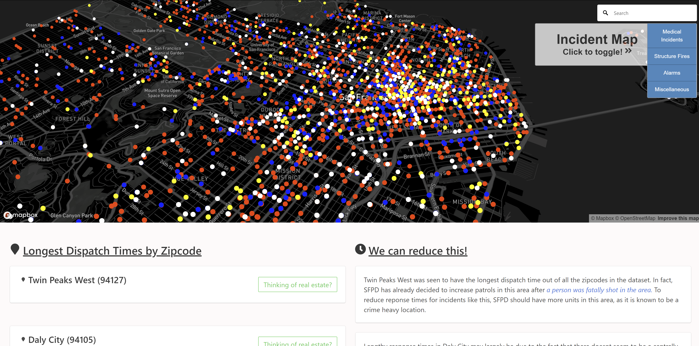

# 2018 Capital One Software Engineering Summit 
#### built by [Kartik Krishnan](https://github.com/kartiktennis)

Challenge: https://www.mindsumo.com/contests/sfpd-dispatch

Submission: https://c1sfpd.surge.sh/

# I Used...
* HTML, CSS, JavaScript, Python, iPython notebook
* [Bulma 0.6.0](https://bulma.io/) for presentability
* [Pandas 0.22.0](https://pandas.pydata.org/) for CSV data processing and calculations in Jupyter Notebook
* [CanvasJS 2.0.2](https://canvasjs.com//) for data visualization
* [Google Maps Geocoding API](https://developers.google.com/maps/documentation/javascript/geocoding) for geographic functionality
* [Mapbox Studio and API](https://www.mapbox.com/developers/) for geographical data visualization

# All Objectives 

### The Main Objectives
- **Visualize the data**: Display or graph 3 metrics or trends from the data set that are interesting to you.
- **Incident Prediction**: Given an address and time, what is the most likely dispatch to be required?
- **Longest Dispatch times**: Which areas take the longest time to dispatch to on average? How can this be reduced? 

### The Bonus Objectives
- **Heat Maps**: Add heat maps that show dispatch frequency, urgency over the city.
- **Crime Correlation**: Based on the type of dispatch and the frequency of dispatch, show the most calm and safe neighborhoods in the city
- **Preparing for the future**:  Which areas are experiencing the greatest increase in dispatch calls? Where and what type of dispatch service would you place to help with the rate of increasing calls?

# My Approach

### **Visualizing the data**: Graph some (any 3) interesting metrics, maps, or trends from the dataset.
Created 2 graphs with Canvasjs:
* **Average Dispatch time vs Call Type**
    * Three call types (Structure Fires, Water Rescues, and Train/Rail Incidents had the greatest avg dispatch times)
* **Call Type vs Number of Occurrences**
    * Medical Incidents were the dominant type by far, accounting for almost 70% of the calls in the dataset
Created geographical map of incident locations usig Mapbox API
* **Incident Map**
    * Medical Incidents, Structure Fires, and Alarms accounted for the majority of the dataset as seen on the map. All other types were grouped into a Miscellaneous category

### **Incident Prediction**: Given an address and time, what is the most likely dispatch to be required?
Find the 5 closest incidents based on inputed address and take the inputed time (format: YYYY-MM-DD H:M:S) and convert to Unix / Epoch Time. Compare this with the unix times of the five incidents and return final answer. 

### **Longest Dispatch Times**:  Which areas take the longest time to dispatch to on average? How can this be reduced?
Take the time difference between 'received_timestamp' and 'dispatch_timestamp' and find the greatest ones. Originally focused only on the incidents corresponding to 
Structure Fires, Water Rescues, and Train Rail incidents, but then later examined other call types. 

### **Preparing for the future**: Which areas are experiencing the greatest increase in dispatch calls? Where and what type of dispatch service would you place to help with the rate of increasing calls?
Identified the top 3 neighborhoods with greatest increase in dispatch calls by examining for each zipcode, the (number of calls on last day)- (number of calls on first day) / 12. This gave me the 'slope' or derivative value for each zipcode. I took the 3 greatest values and then found which incident was most common for each of the three zipcodes. This turned out to be Medical for all of them. 

# Check out the project yourself!

* Clone the repository: `git clone https://github.com/kartiktennis/sfpd-dispatch`
